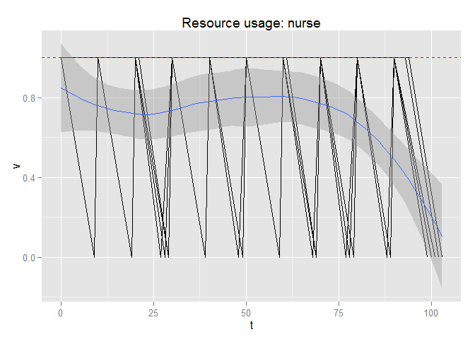

# simmer
by Bart Smeets  

*simmer* is a discrete event package for the R language. It is developed with my own specific requirements for simulating day-to-day hospital proceses and thus might not be suited for everyone. It is designed to be as simple to use as possible and tries to be compatible with the piping features of [magrittr](https://github.com/smbache/magrittr). 

## Installation

The installation requires the [devtools](https://github.com/hadley/devtools) package to be installed.


```r
devtools$install_github("Bart6114/simmer")
```

## Using simmer

First load the package.


```r
library(simmer)
```

Set-up a simple trajectory (the column names are important!).


```r
t1<-
  read.table(header=T, text=
               "event_id  description   resource        amount  duration      successor
                1         intake        nurse           1       10            2
                2         consultation  doctor          1       20            3
                3         planning      administration  1       5             NA"  )
```

The ```successor``` describes which event is started next. An ```successor``` value of ```NA``` means that the end of the trajectory has been reached. The ```duration``` and ```successor``` value are parsed as R commands and re-evaluated for every individual entity. This means that this does not have to be a static value and the concept of probability can be introduced. The following trajectory shows this.


```r
t2<-
  read.table(header=T, text=
               "event_id  description   resource        amount  duration      successor
                1         intake        nurse           1       rnorm(1,10)   2
                2         consultation  doctor          1       rnorm(1,20)   sample(c(NA,3),1)
                3         planning      administration  1       rnorm(1,5)    NA"  )
```

In the above trajectory the ```duration``` is drawn from a normal distribution with a given mean. The ```successor``` of event 2 is either ```NA``` (end of trajectory) or event 3.

When the trajectory is know, a simulator object can be build. In the below example, a simulator is instantiated and three types of resources are added (each with a capacity of 1).


```r
library(magrittr)

sim<-
  create_simulator(name = "SuperDuperSim") %>%
  add_resource("nurse", 1) %>%
  add_resource("doctor", 1) %>%
  add_resource("administration", 1)
```

The simulator object is extended by adding a trajectory and adding 10 entities wich are activated with an interval of 10 minutes.


```r
sim<-
  sim %>%
  add_trajectory("Trajectory1",t2) %>%
  add_entities_with_interval(10, "patient", "Trajectory1", 10)
```

If we only simulate the entities going through the trajectory 1 time we won't get a good look on the stability of the system, so we add a replicator and simulate it 10 times.


```r
sim<-
  sim %>%
  replicator(10)
```

The simulation is now ready for a test run; just let it ```simmer``` for a bit.


```r
sim <-
  sim %>%
  simmer()
```

After some simmering, we can have a look at the simulation results. Here's a look at the usage of the *nurse* resource across the simulation timespan.


```r
plot_resource_usage(sim, "nurse")
```

```
## Loading required package: ggplot2
## Loading required package: dplyr
## 
## Attaching package: 'dplyr'
## 
## The following objects are masked from 'package:stats':
## 
##     filter, lag
## 
## The following objects are masked from 'package:base':
## 
##     intersect, setdiff, setequal, union
## 
## geom_smooth: method="auto" and size of largest group is <1000, so using loess. Use 'method = x' to change the smoothing method.
```

 

**DOCUMENTATION TO BE CONTINUED**


