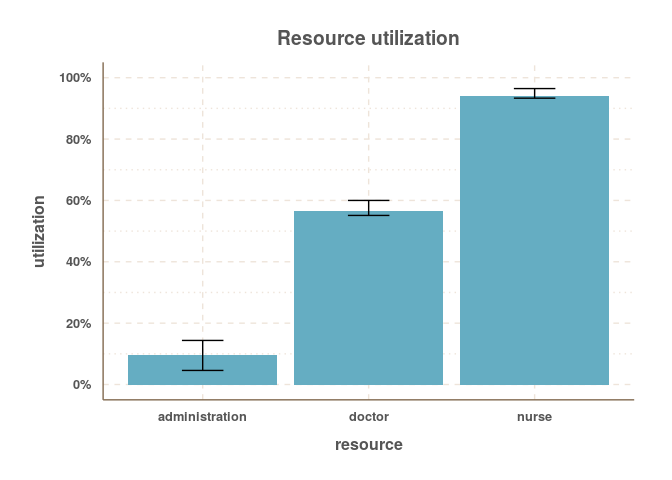
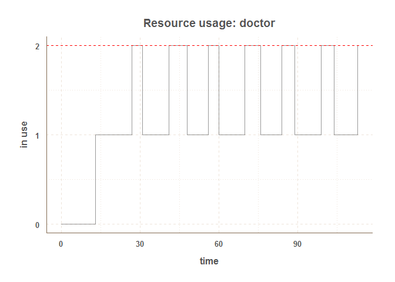
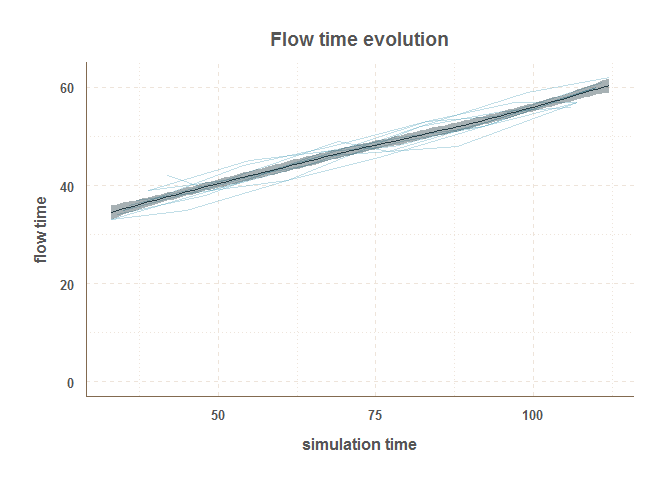

# simmer
[](https://travis-ci.org/Bart6114/simmer)

*by Bart Smeets -- bartsmeets86@gmail.com*

__*simmer* is under heavy development and its internals and syntax can still change extensively over the coming time__

*simmer* is a discrete event package for the R language. It is developed with my own specific requirements for simulating day-to-day hospital proceses and thus might not be suited for everyone. It is designed to be as simple to use as possible and tries to be compatible with the chaining/piping workflow introduced by the [magrittr](https://github.com/smbache/magrittr) package. 


## Installation

The installation requires the [devtools](https://github.com/hadley/devtools) package to be installed.


```r
devtools::install_github("Bart6114/simmer")
```

## Using simmer

First load the package.


```r
library(simmer)
```

Set-up a simple trajectory. Let's say we want to simulate a ambulatory consultation where a patient is first seen by a nurse for an intake, next by a doctor for the consultation and finally by administrative staff to schedule a follow-up appointment.


```r
t0<-
  create_trajectory("my trajectory") %>%
  ## add an intake event 
  add_seize_event("nurse",1.0) %>%
  add_timeout_event(15) %>%
  add_release_event("nurse",1.0) %>%
  ## add a consultation event
  add_seize_event("doctor",1.0) %>%
  add_timeout_event(20) %>%
  add_release_event("doctor",1.0) %>%
  ## add a planning event
  add_seize_event("administration",1.0) %>%
  add_timeout_event(5) %>%
  add_release_event("administration",1.0)
```

The time-out duration is evaluated as an R command if it is entered as a character value. This means that this does not have to be a static value and the concept of probability can be introduced. The following trajectory shows this.


```r
t1<-
  create_trajectory("my trajectory") %>%
  ## add an intake event 
  add_seize_event("nurse",1.0) %>%
  add_timeout_event("rnorm(1,15)") %>%
  add_release_event("nurse",1.0) %>%
  ## add a consultation event
  add_seize_event("doctor",1.0) %>%
  add_timeout_event("rnorm(1,20)") %>%
  add_release_event("doctor",1.0) %>%
  ## add a planning event
  add_seize_event("administration",1.0) %>%
  add_timeout_event("rnorm(1,5)") %>%
  add_release_event("administration",1.0)
```

In the above trajectory the ```duration``` is drawn from a normal distribution with a given mean.

When the trajectory is know, a simulator object can be build. In the below example, a simulator is instantiated and three types of resources are added. The *nurse* and *administration* resource each with a capacity of 1 and the *doctor* resource with a capacity of 2. We specify that we to replicate the simulation 10 times using the ```n``` argument. We also specify that we want to limit the run-time to 120 time units using the ```until``` argument.


```r
sim<-
  create_simulator("SuperDuperSim", n = 10, until = 80) %>%
  add_resource("nurse", 1) %>%
  add_resource("doctor", 2) %>%
  add_resource("administration", 1)
```

The simulator object is extended by adding 10 entities - with trajectory ```t1``` - wich are activated with an interval of about 10 minutes.


```r
sim<-
  sim %>%
  add_entities_with_interval(trajectory = t1, n = 10, name_prefix = "patient", interval =  "rnorm(1, 10, 2)")
```

Entities can also be added on an individual basis. In the below example 1 extra individual entity is added which will be activated at time 100.


```r
sim<-
  sim %>%
  add_entity(trajectory = t1, name = "separate_patient" , activation_time =  100)
```

The simulation is now ready for a test run; just let it ```simmer``` for a bit.


```r
sim <-
  sim %>%
  simmer()
```

### Resource utilization

After you've left it simmering for a bit (pun intended), we can have a look at the overall resource utilization. The top and bottom of the error bars show respectively the 25th and 75th percentile of the utilization across all the replications. The top of the bar shows the median utilization.


```r
plot_resource_utilization(sim, c("nurse", "doctor","administration"))
```

 

It is also possible to have a look at a specific resource and its activity during the simulation.


```r
plot_resource_usage(sim, "doctor")
```

 

In the above graph, the individual lines are all seperate replications. A smooth line is drawn over them to get a sense of the *'average'* utilization. You can also see here that the ```until``` time of 120 was most likely lower than the unrestricted run time of the simulation. It is also possible to get a graph about a specific replication by simply specifying the replication number. In the example below the 6th replication is shown.


```r
plot_resource_usage(sim, "doctor", 6)
```

 

One can also query the raw resource monitor data.


```r
head(
  get_resource_monitor_values(sim, "nurse")
  )
```

```
##   time value resource replication
## 1    0     0    nurse           1
## 2    0     1    nurse           1
## 3   15     0    nurse           1
## 4   15     1    nurse           1
## 5   30     0    nurse           1
## 6   30     1    nurse           1
```

### Flow time

Next we can have a look at the evolution of the entities' flow time during the simulation. In the below plot, each individual line represents a replication. A smoothline is drawn over them. All entities that didn't finish their entire trajectory are excluded from the plot.


```r
plot_evolution_entity_times(sim, type = "flow_time")
```

 

Similarly one can have a look at the evolution of the activity times with ```type = "activity_time"``` and waiting times with ```type = "waiting_time"```.

It is also possible to extract the raw entity monitor data.


```r
head(
  get_entity_monitor_values(sim)
  )
```

```
##   time value entity_id entity_name replication
## 1    0  -999         0   patient_1           1
## 2    0     1         0   patient_1           1
## 3   15     0         0   patient_1           1
## 4   15     1         0   patient_1           1
## 5   33     0         0   patient_1           1
## 6   33     1         0   patient_1           1
```

Or to look at the aggregated data.


```r
head(
  get_entity_monitor_values(sim, aggregated = T)
  )
```

```
##   replication entity_id start_time end_time finished activity_time
## 1           1         0          0       39        1            39
## 2           1         1          8       52        1            37
## 3           1         2         20       67        1            37
## 4           2         0          0       40        1            40
## 5           2         1          8       52        1            37
## 6           2         2         20       67        1            37
##   flow_time waiting_time
## 1        39            0
## 2        44            7
## 3        47           10
## 4        40            0
## 5        44            7
## 6        47           10
```

**DOCUMENTATION TO BE CONTINUED**

## Roadmap

* Better next step algorithm
* More flexible method to release/seize resources (alternative trajectory construction?)
* Time-specific resource availability
* Implement main simulation loop in C++ (using Rcpp)

## Contact

For bugs and/or issues: create a new issue on GitHub.

Other questions or comments: bartsmeets86@gmail.com
