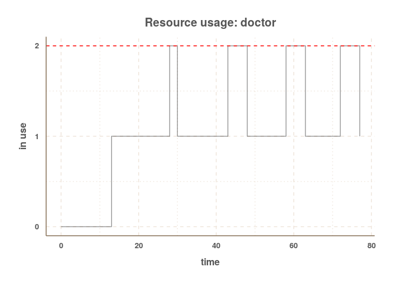

# simmer
*by Bart Smeets -- bartsmeets86@gmail.com*

__*simmer* is under heavy development and its internals and syntax can still change extensively over the coming time__

*simmer* is a discrete event package for the R language. It is developed with my own specific requirements for simulating day-to-day hospital proceses and thus might not be suited for everyone. It is designed to be as simple to use as possible and tries to be compatible with the piping features of [magrittr](https://github.com/smbache/magrittr). 


## Installation

The installation requires the [devtools](https://github.com/hadley/devtools) package to be installed.


```r
devtools$install_github("Bart6114/simmer")
```

## Using simmer

First load the package.


```r
library(simmer)
```

Set-up a simple trajectory (the column names are important!).


```r
t1<-
  read.table(header=T, text=
               "event_id  description   resource        amount  duration      successor
                1         intake        nurse           1       15            2
                2         consultation  doctor          1       20            3
                3         planning      administration  1       5             NA"  )
```

The ```successor``` describes which event is started next. An ```successor``` value of ```NA``` means that the end of the trajectory has been reached. The ```duration``` and ```successor``` value are parsed as R commands and re-evaluated for every individual entity. This means that this does not have to be a static value and the concept of probability can be introduced. The following trajectory shows this.


```r
t2<-
  read.table(header=T, text=
               "event_id  description   resource        amount  duration      successor
                1         intake        nurse           1       rnorm(1,15)   2
                2         consultation  doctor          1       rnorm(1,20)   sample(c(NA,3),1)
                3         planning      administration  1       rnorm(1,5)    NA"  )
```

In the above trajectory the ```duration``` is drawn from a normal distribution with a given mean. The ```successor``` of event 2 is either ```NA``` (end of trajectory) or event 3.

When the trajectory is know, a simulator object can be build. In the below example, a simulator is instantiated and three types of resources are added. The*nurse* and *administration* with a capacity of 1 and the *doctor* resource with a capacity of 2.


```r
library(magrittr)

sim<-
  create_simulator(name = "SuperDuperSim") %>%
  add_resource("nurse", 1) %>%
  add_resource("doctor", 2) %>%
  add_resource("administration", 1)
```

The simulator object is extended by adding a trajectory and adding 10 entities wich are activated with an interval of 10 minutes.


```r
sim<-
  sim %>%
  add_trajectory("Trajectory1",t2) %>%
  add_entities_with_interval(10, "patient", "Trajectory1", 10)
```

If we only simulate the entities going through the trajectory 1 time we won't get a good look on the stability of the system, so we add a replicator and simulate it 10 times.


```r
sim<-
  sim %>%
  replicator(10)
```

The simulation is now ready for a test run; just let it ```simmer``` for a bit (or for 120 time units to be precise).


```r
sim <-
  sim %>%
  simmer(until = 240)
```

### Resource utilization

After you've left it simmering for a bit (pun intended), we can have a look at the overall resource utilization. The top and bottom of the error bars show respectively the 25th and 75th percentile of the utilization across all the replications. The top of the bar shows the median utilization.


```r
plot_resource_utilization(sim)
```

 

It is also possible to have a look at a specific resource and its activity during the simulation.


```r
plot_resource_usage(sim, "doctor")
```

 

In the above graph, the individual lines are all seperate replications. A smooth line is drawn over them to get a sense of the *'average'* utilization. It is also possible to get a graph about a specific replication by simply specifying the replication number. In the example below the 6th replication is shown.


```r
plot_resource_usage(sim, "doctor", 6)
```

 

### Flowtime

We can also have a look at the evolution of the entities' flow time during the simulation. In the below plot, each individual line represents a replication. A smoothline is drawn over them.


```r
plot_evolution_entity_times(sim, "flow_time")
```

 

Similarly one can have a look at the evolution of the activity times with ```type = "activity_time"``` and waiting times with ```type = "waiting_time"```.

**DOCUMENTATION TO BE CONTINUED**

## Contact

For bugs and/or issues: create a new issue on GitHub.

Other questions or comments: bartsmeets86@gmail.com


