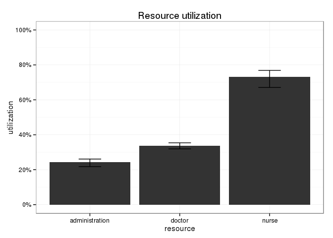
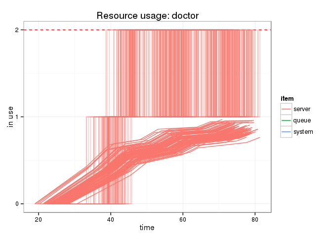
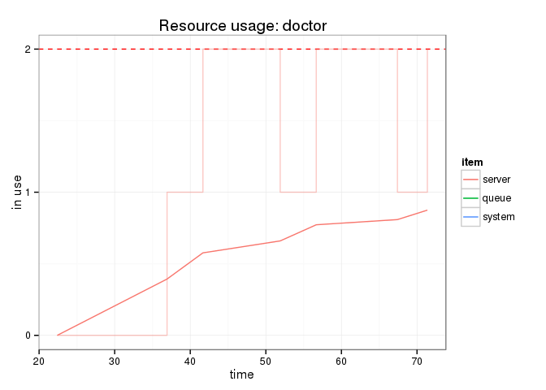
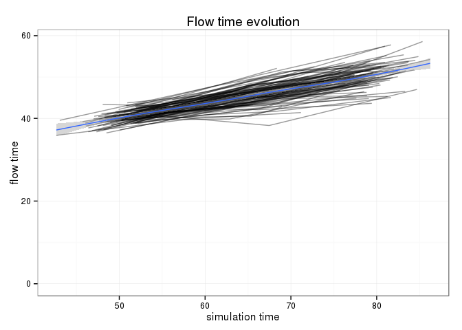

# simmer [](https://travis-ci.org/Bart6114/simmer)

*by Bart Smeets (bartsmeets86@gmail.com) & Iñaki Ucar (i.ucar86@gmail.com)*

*simmer* is a discrete event simulation (DES) package for the R language designed to be a generic framework like [SimPy](https://simpy.readthedocs.org) or [SimJulia](http://simjuliajl.readthedocs.org). Although R alone is definitely not made for DES, we use [Rcpp](http://www.rcpp.org/) to boost the performance of *simmer*. This faces us with an important trade-off between flexibility and performance, depending on how much code remains in R or goes to C++ respectively.

Our implementation solves this problem by introducing the concept of *trajectory*: a common path in the simulation model for arrivals of the same type. As we will see, it is pretty flexible and simple to use, and leverages the chaining/piping workflow introduced by [R6](https://cran.r-project.org/web/packages/R6/) classes. In terms of performance, *simmer* is faster than SimPy when it comes to simulating queue networks.


## Installation

The installation requires the [devtools](https://github.com/hadley/devtools) package.


```r
devtools::install_github("Bart6114/simmer")
```

Please note that the package contains some C++ code and you thus need a development environment to build the package (e.g. [Rtools](http://cran.r-project.org/bin/windows/Rtools/) for Windows). If you don't want to build the package yourself and you're on Windows you could try a pre-built binary package [here](https://github.com/Bart6114/simmer/releases/).

## Using *simmer*

First, load the package.


```r
library(simmer)
```

Set-up a simple trajectory. Let's say we want to simulate an ambulatory consultation where a patient is first seen by a nurse for an intake, next by a doctor for the consultation and finally by administrative staff to schedule a follow-up appointment.


```r
t0 <- Trajectory$new("my trajectory") $
  ## add an intake activity 
  seize("nurse", 1) $
  timeout(function() rnorm(1, 15)) $
  release("nurse", 1) $
  ## add a consultation activity
  seize("doctor", 1) $
  timeout(function() rnorm(1, 20)) $
  release("doctor", 1) $
  ## add a planning activity
  seize("administration", 1) $
  timeout(function() rnorm(1, 5)) $
  release("administration", 1)
```

The timeout argument is evaluated dynamically, so it must be callable and must return a numeric value (note: negative values are automatically converted to positive). Moreover, this function may be as complex as you need and may do whatever you want: interact with entities in your simulation model, get resources' status, make decisions according to the latter...

When the trajectory is known, the simulation environment can be built. In the example below, an environment is instantiated and three types of resources are added. The *nurse* and *administration* resources, each one with a capacity of 1, and the *doctor* resource, with a capacity of 2. The last method adds a generator of arrivals (patients) following the trajectory ```t0```. The time between patients is about 10 minutes (a Gaussian of ```mean=10``` and ```sd=2```).


```r
simmer <- Simmer$new("SuperDuperSim") $
  add_resource("nurse", 1) $
  add_resource("doctor", 2) $
  add_resource("administration", 1) $
  add_generator("patient", t0, function() rnorm(1, 10, 2))
```

The simulation is now ready for a test run; just let it *simmer* for a bit. Below, we specify that we want to limit the runtime to 80 time units using the ```until``` argument. After that, we verify the current simulation time (```now()```) and when will be the next event (```peek()```).


```r
simmer$run(until=80)
simmer$now()
```

```
## [1] 80.16184
```

```r
simmer$peek()
```

```
## [1] 80.16184
```

It is possible to run the simulation step by step, and such a method is chainable too.


```r
simmer$step()
simmer$step()$step()$step()
simmer$now()
```

```
## [1] 80.68287
```

```r
simmer$peek()
```

```
## [1] 80.68287
```

Also, it is possible to resume the automatic execution simply by specifying a longer runtime. Below, we continue the execution until 120 time units.


```r
simmer$run(until=120)
```

Finally, you can reset the simulation, flush all results, resources and generators, and restart from the beginning.


```r
simmer$reset()$run(until=80)
```

### Replication

It is very easy to replicate a simulation multiple times using standard R functions.


```r
reps <- lapply(1:100, function(i) {
  Simmer$new("SuperDuperSim") $
    add_resource("nurse", 1) $
    add_resource("doctor", 2) $
    add_resource("administration", 1) $
    add_generator("patient", t0, function() rnorm(1, 10, 2)) $
    run(80)
})
```

The advantage of the latter approach is that, if the individual simulations are heavy, it is straightforward to parallelize the execution of replicas (for instance, in the next example we use the function ```mclapply``` from the package [parallel](https://stat.ethz.ch/R-manual/R-devel/library/parallel/doc/parallel.pdf)). Nevertheless, the external pointers to the C++ *simmer* core are no longer valid when the parallelized execution ends. Thus, it is necessary to extract the results for each thread at the end of the execution. This can be done with the helper class ```Simmer.wrap``` as follows.


```r
library(parallel)

reps <- mclapply(1:100, function(i) {
  Simmer.wrap$new(
  Simmer$new("SuperDuperSim") $
    add_resource("nurse", 1) $
    add_resource("doctor", 2) $
    add_resource("administration", 1) $
    add_generator("patient", t0, function() rnorm(1, 10, 2)) $
    run(80)
  )
})
```

This helper class brings the simulation data back to R and makes it accessible through the same methods that the ```Simmer``` class.


```r
reps[[1]]$get_capacity("doctor")
```

```
## [1] 2
```

```r
reps[[1]]$get_queue_size("doctor")
```

```
## [1] Inf
```

```r
head(
  reps[[1]]$get_mon_resources()
)
```

```
##       time server queue system resource
## 1 10.84529      0     0      0    nurse
## 2 19.32764      1     0      1    nurse
## 3 24.78814      1     1      2    nurse
## 4 28.43090      1     0      1    nurse
## 5 37.41629      1     1      2    nurse
## 6 38.78439      1     2      3    nurse
```

```r
head(
  reps[[1]]$get_mon_arrivals()
)
```

```
##       name start_time end_time activity_time finished
## 1 patient0   10.84529 49.96901      39.12372     TRUE
## 2 patient1   19.32764 64.40916      39.62103     TRUE
## 3 patient2   28.43090 79.95606      41.17168     TRUE
```

Unfortunately, as the C++ simulation cores are destroyed, parallelization does not allow to resume the execution of replicas.

### Advanced trajectories

The ```branch()``` method offers the possibility of adding a branch in the trajectory. The following example shows how a trajectory can be built with a 50-50 chance for an arrival to pass through each branch.


```r
t1 <- Trajectory$new("trajectory with a branch") $
  seize("server", 1) $
  branch(function() sample(1:2, 1), merge=c(T, F), 
    Trajectory$new("branch1") $
      timeout(function() 1),
    Trajectory$new("branch2") $
      timeout(function() rexp(1, 3)) $
      release("server", 1)
  ) $
  release("server", 1)
```

When an arrival gets to the branch, the first argument is evaluated to select a specific branch to follow, so it must be callable and must return a numeric value between 1 and ```n```, where ```n``` is the number of branches defined. The second argument, ```merge```, indicates whether the arrival must continue executing the activities after the selected branch or not. In the example above, only the first branch continues to the last *release*.

### Resource utilization

After you've left it simmering for a bit (pun intended), we can have a look at the overall resource utilization. The top and bottom of the error bars show respectively the 25th and 75th percentile of the utilization across all the replications. The top of the bar shows the median utilization.


```r
plot_resource_utilization(reps, c("nurse", "doctor","administration"))
```

 

It is also possible to have a look at a specific resource and its activity during the simulation.


```r
plot_resource_usage(reps, "doctor", items="server", steps=T)
```

 

In the above graph, the individual lines are all separate replications. The step lines are instantaneous utilization and the smooth line is a running average. Let's take a look now at a specific replication. In the example below the 6th replication is shown.


```r
plot_resource_usage(reps[[6]], "doctor", items="server", steps=T)
```

 

### Flow time

Next we can have a look at the evolution of the arrivals' flow time during the simulation. In the below plot, each individual line represents a replication. A smooth line is drawn over them. All arrivals that didn't finish their entire trajectory are excluded from the plot.


```r
plot_evolution_arrival_times(reps, type = "flow_time")
```

 

Similarly one can have a look at the evolution of the activity times with ```type = "activity_time"``` and waiting times with ```type = "waiting_time"```.

**DOCUMENTATION TO BE CONTINUED**

## Roadmap

* Refine queue discipline (add priorities).
* Time-specific resource availability.

## Contact

For bugs and/or issues: create a new issue on GitHub.

Other questions or comments: bartsmeets86@gmail.com
