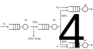

```{r, cache = FALSE, include=FALSE}
knitr::opts_chunk$set(collapse = T, comment = "#>", 
                      fig.width = 6, fig.height = 4, fig.align = "center")

required <- c("simmer.plot", "dplyr")

if (!all(unlist(lapply(required, function(pkg) requireNamespace(pkg, quietly = TRUE)))))
  knitr::opts_chunk$set(eval = FALSE)
```

```{r, message=FALSE}
library(simmer)
library(simmer.plot)
library(parallel)
set.seed(1234)
```

## The M/M/1 system

In Kendall's notation, an M/M/1 system has exponential arrivals (__M__/M/1), a single server (M/M/__1__) with exponential service time (M/__M__/1) and an inifinite queue (implicit M/M/1/__$\infty$__). For instance, people arriving at an ATM at rate $\lambda$, waiting their turn in the street and withdrawing money at rate $\mu$.

Let us remember the basic parameters of this system:

$$\begin{aligned}
\rho &= \frac{\lambda}{\mu} &&\equiv \mbox{Server utilization} \\
N &= \frac{\rho}{1-\rho} &&\equiv \mbox{Average number of customers in the system (queue + server)} \\
T &= \frac{N}{\lambda} &&\equiv \mbox{Average time in the system (queue + server) [Little's law]} \\
\end{aligned}$$

Whenever $\rho < 1$. If that is not true, it means that the system is unstable: there are more arrivals than the server is capable of handling, and the queue will grow indefinitely.

The simulation of an M/M/1 system is quite simple using `simmer`:

```{r}
lambda <- 2
mu <- 4
rho <- lambda/mu # = 2/4

mm1.trajectory <- trajectory() %>%
  seize("resource", amount=1) %>%
  timeout(function() rexp(1, mu)) %>%
  release("resource", amount=1)

mm1.env <- simmer() %>%
  add_resource("resource", capacity=1, queue_size=Inf) %>%
  add_generator("arrival", mm1.trajectory, function() rexp(1, lambda)) %>% 
  run(until=2000)
```

Our `simmer.plot` package provides convenience plotting functions to quickly visualise the usage of a resource over time, for instance. Down below, we can see how the simulation converges to the theoretical average number of customers in the system.

```{r}
# Theoretical value
mm1.N <- rho/(1-rho)

# Evolution of the average number of customers in the system
plot(mm1.env, "resources", "usage", "resource", items="system") +
  geom_hline(yintercept=mm1.N)
```

It is possible also to visualise, for instance, the instantaneous usage of individual elements by playing with the parameters `items` and `steps`.

```{r}
plot(mm1.env, "resources", "usage", "resource", items=c("queue", "server"), steps=TRUE) +
  xlim(0, 20) + ylim(0, 4)
```

Experimentally, we obtain the time spent by each customer in the system and we compare the average with the theoretical expression.

```{r}
mm1.arrivals <- get_mon_arrivals(mm1.env)
mm1.t_system <- mm1.arrivals$end_time - mm1.arrivals$start_time

mm1.T <- mm1.N / lambda
mm1.T ; mean(mm1.t_system)
```

It seems that it matches the theoretical value pretty well. But of course we are picky, so let's take a closer look, just to be sure. Replication can be done with standard R tools:

```{r, eval=FALSE}
envs <- mclapply(1:100, function(i) {
  simmer() %>%
    add_resource("resource", capacity=1, queue_size=Inf) %>%
    add_generator("arrival", mm1.trajectory, function() rexp(100, lambda)) %>%
    run(1000/lambda) %>%
    wrap()
}, mc.set.seed=FALSE)
```

Parallelizing has the shortcoming that we lose the underlying C++ objects when each thread finishes, but the `wrap` function does all the magic for us retrieving the monitored data. Let's perform a simple test:

```{r, eval=FALSE}
t_system <- get_mon_arrivals(envs) %>%
  dplyr::mutate(t_system = end_time - start_time) %>%
  dplyr::group_by(replication) %>%
  dplyr::summarise(mean = mean(t_system))

t.test(t_system$mean)
#> 
#> 	One Sample t-test
#> 
#> data:  t_system$mean
#> t = 112.35, df = 99, p-value < 2.2e-16
#> alternative hypothesis: true mean is not equal to 0
#> 95 percent confidence interval:
#>  0.4883420 0.5059016
#> sample estimates:
#> mean of x 
#> 0.4971218 
```

Finally, the inverse of the mean difference between arrivals is the effective rate, which matches (approx.) the real lambda because there are no rejections.

```{r}
lambda; 1/mean(diff(subset(mm1.arrivals, finished==TRUE)$start_time))
```

Moreover, an M/M/1 satisfies that the distribution of the time spent in the system is, in turn, an exponential random variable with average $T$.

```{r}
qqplot(mm1.t_system, rexp(1000, 1/mm1.T))
abline(0, 1, lty=2, col="red")
```

## M/M/c/k systems

An M/M/c/k system keeps exponential arrivals and service times, but has more than one server in general and a finite queue, which often is more realistic. For instance, a router may have several processor to handle packets, and the in/out queues are necessarily finite.

This is the simulation of an M/M/2/3 system (2 server, 1 position in queue). Note that the trajectory is identical to the M/M/1 case.

```{r}
lambda <- 2
mu <- 4

mm23.trajectory <- trajectory() %>%
  seize("server", amount=1) %>%
  timeout(function() rexp(1, mu)) %>%
  release("server", amount=1)

mm23.env <- simmer() %>%
  add_resource("server", capacity=2, queue_size=1) %>%
  add_generator("arrival", mm23.trajectory, function() rexp(1, lambda)) %>%
  run(until=2000)
```

In this case, there are rejections when the queue is full.

```{r}
mm23.arrivals <- get_mon_arrivals(mm23.env)
mm23.arrivals %>%
  dplyr::summarise(rejection_rate = sum(!finished)/length(finished))
```

Despite this, the time spent in the system still follows an exponential random variable, as in the M/M/1 case, but the average has dropped.

```{r}
mm23.t_system <- mm23.arrivals$end_time - mm23.arrivals$start_time
# Comparison with M/M/1 times
qqplot(mm1.t_system, mm23.t_system)
abline(0, 1, lty=2, col="red")
```

## Queueing Networks

Let us consider the following network of queues (example taken from [Grotto Networking](http://www.grotto-networking.com/DiscreteEventPython.html#NetQueues)):



There are three exponential generators ($\lambda_1$, $\lambda_2$, $\lambda_4$) that inject messages with exponential size of mean 100 bytes. There are four M/D/1 queues with a deterministic rate equal to 220 bytes/s. There is a 25\% probability that messages from $\lambda_1$ are dropped before the second queue, and a fork 35/65\% for the output of the second queue to reach queues 3 and 4. We are interested, for instance, in the accumulated waiting time for messages entering queue 1 and exiting queue 3 or 4.

The original author of this example, Greg M. Bernstein, simulated this problem with [this Python code](http://www.grotto-networking.com/files/DESPython/QueueNet2.py). We'll start by setting up the main constants and a couple of functions to set the message size and seize an M/D/1 queue:

```{r}
mean_pkt_size <- 100        # bytes
lambda1 <- 2                # pkts/s
lambda3 <- 0.5              # pkts/s
lambda4 <- 0.6              # pkts/s
rate <- 2.2 * mean_pkt_size # bytes/s

# set an exponential message size of mean mean_pkt_size
set_msg_size <- function(.)
  set_attribute(., "size", function() rexp(1, 1/mean_pkt_size))

# seize an M/D/1 queue by id; the timeout is function of the message size
md1 <- function(., id)
  seize(., paste0("md1_", id), 1) %>%
  timeout(function(attrs) attrs[["size"]] / rate) %>%
  release(paste0("md1_", id), 1)
```

The next step is to set up the three points of attachment for our generators:

```{r}
to_queue_1 <- trajectory() %>%
  set_msg_size() %>%
  md1(1) %>%
  leave(0.25) %>%
  md1(2) %>%
  branch(function() (runif(1) > 0.65) + 1, c(F, F),
         trajectory() %>%
           md1(3),
         trajectory() %>%
           md1(4))

to_queue_3 <- trajectory() %>%
  set_msg_size() %>%
  md1(3)

to_queue_4 <- trajectory() %>%
  set_msg_size() %>%
  md1(4)
```

Finally, we prepare and run the simulation environment with the resources and generators required:

```{r}
env <- simmer()
for (i in 1:4) env %>% 
  add_resource(paste0("md1_", i))
env %>%
  add_generator("arrival1_", to_queue_1, function() rexp(1, lambda1), mon=2) %>%
  add_generator("arrival3_", to_queue_3, function() rexp(1, lambda3), mon=2) %>%
  add_generator("arrival4_", to_queue_4, function() rexp(1, lambda4), mon=2) %>%
  run(4000)
```

In the analysis, we filter arrivals from generator 1 that reach queues 3 and 4, and we examine the average waiting time and the total number of messages:

```{r}
res <- get_mon_arrivals(env, per_resource = TRUE) %>%
  dplyr::select(name, resource) %>%
  dplyr::filter(resource %in% c("md1_3", "md1_4"))
arr <- get_mon_arrivals(env) %>%
  dplyr::mutate(waiting_time = end_time - (start_time + activity_time),
                generator = regmatches(name, regexpr("arrival[[:digit:]]", name))) %>%
  dplyr::left_join(res) %>%
  dplyr::group_by(generator, resource)

dplyr::summarise(arr, average = sum(waiting_time) / n())
get_n_generated(env, "arrival1_") + get_n_generated(env, "arrival4_")
dplyr::count(arr)
```
