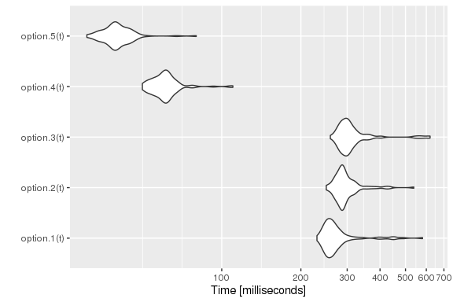

```{r, echo = FALSE, message = FALSE}
knitr::opts_chunk$set(collapse = T, comment = "#>",
                      fig.width = 6, fig.height = 4, fig.align = "center")
library(ggplot2)
theme_set(theme_bw())
```

<script type="text/x-mathjax-config">
  MathJax.Ajax.config.path["Contrib"] = "https://cdn.mathjax.org/mathjax/contrib";
  MathJax.Hub.Config({
    TeX: {extensions: ["[Contrib]/xyjax/xypic.js","AMSmath.js","AMSsymbols.js"]},
    tex2jax: {inlineMath: [["$","$"],["\\(","\\)"]]}
  });
</script>

```{r, message=FALSE}
library(simmer)
library(ggplot2)
library(dplyr)
library(tidyr)
set.seed(1234)
```

## Example 1

A gas station has a single pump and no space for vehicles to wait (if a vehicle arrives and the pump is not available, it leaves). Vehicles arrive to the gas station following a Poisson process with a rate of $\lambda=3/20$ vehicles per minute, of which 75% are cars and 25% are motorcycles. The refuelling time can be modelled with an exponential random variable with mean 8 minutes for cars and 3 minutes for motorcycles, that is, the services rates are $\mu_\mathrm{c}=1/8$ cars and $\mu_\mathrm{m}=1/3$ motorcycles per minute respectively.

This problem is described by the following continuous-time Markov chain:

$$\xymatrix{
*=<15mm,8mm>[o][F]{car} \ar@/^/[r]^{\mu_\mathrm{c}} &
*=<15mm,8mm>[o][F]{empty} \ar@/^/[l]^{p\lambda} \ar@/^/[r]^{(1-p)\lambda}  &
*=<15mm,8mm>[o][F]{m/cycle} \ar@/^/[l]^{\mu_\mathrm{m}}
}\qquad\qquad
Q = \begin{pmatrix}
-\mu_\mathrm{c} & \mu_\mathrm{c} & 0 \\
p\lambda & -\lambda & (1-p) \lambda \\
0 & \mu_\mathrm{m} & -\mu_\mathrm{m} 
\end{pmatrix}$$

with $p=0.75$. The chain is irreducible and recurrent. To theoretically find the steady state distribution, we have to solve the balance equations

$$pQ = 0$$

with the constraint

$$\sum_i p_i = 1$$

There are $\operatorname{dim}(Q)-1$ independent columns, so the latter constraint is equivalent to substitute any column by ones and match it to one at the other side of the equation, that is:

$$p\cdot\begin{pmatrix}
1 & 1/8 & 0 \\
1 & -3/20 & 0.25\cdot 3/20 \\
1 & 1/3 & -1/3 
\end{pmatrix} = (1, 0, 0)$$

The solution $p$ represents the probability of being at each state in the long-term. Therefore, we can calculate the average number of vehicles in the system by summing these probabilities multiplied by the number of vehicles at each state. In our case, 

$$N = 1\cdot p_1 + 0\cdot p_2 + 1\cdot p_3$$

```{r}
# Arrival rate
lambda <- 3/20
# Service rate (cars, motorcycles)
mu <- c(1/8, 1/3)
# Probability of car
p <- 0.75

# Theoretical resolution
A <- matrix(c(1,   mu[1],            0,
              1, -lambda, (1-p)*lambda,
              1,   mu[2],       -mu[2]), byrow=T, ncol=3)
B <- c(1, 0, 0)
P <- solve(t(A), B)
N_average_theor <- sum(P * c(1, 0, 1)) ; N_average_theor
```

Now, we are going to simulate the system with `simmer` and verify that it converges to the theoretical solution. There are various options for selecting the model. As a first approach, due to the properties of Poisson processes, we can break down the problem into two trajectories (one for each type of vehicle), which differ in their service time only, and therefore two generators with rates $\lambda_\mathrm{c} = p\lambda$ and $\lambda_\mathrm{m} = (1-p)\lambda$.

```{r}
option.1 <- function(t) {
  car <- create_trajectory() %>%
    seize("pump", amount=1) %>%
    timeout(function() rexp(1, mu[1])) %>%
    release("pump", amount=1)
  
  mcycle <- create_trajectory() %>%
    seize("pump", amount=1) %>%
    timeout(function() rexp(1, mu[2])) %>%
    release("pump", amount=1)
  
  simmer() %>%
    add_resource("pump", capacity=1, queue_size=0) %>%
    add_generator("car", car, function() rexp(1, p*lambda)) %>%
    add_generator("mcycle", mcycle, function() rexp(1, (1-p)*lambda)) %>%
    run(until=t)
}
```

Other arrival processes may not have this property, so we would define a single generator for all kind of vehicles and a single trajectory as follows. In order to distinguish between cars and motorcycles, we could define a branch after seizing the resource to select the proper service time.

```{r}
option.2 <- function(t) {
  vehicle <- create_trajectory() %>%
    seize("pump", amount=1) %>%
    branch(function() sample(c(1, 2), 1, prob=c(p, 1-p)), c(T, T), 
           create_trajectory("car") %>%
             timeout(function() rexp(1, mu[1])),
           create_trajectory("mcycle") %>%
             timeout(function() rexp(1, mu[2]))) %>%
    release("pump", amount=1)
  
  simmer() %>%
    add_resource("pump", capacity=1, queue_size=0) %>%
    add_generator("vehicle", vehicle, function() rexp(1, lambda)) %>%
    run(until=t)
}
```

But this option adds an unnecessary overhead since there is an additional call to an R function to select the branch, and therefore performance decreases. A much better option is to select the service time directly inside the `timeout` function.

```{r}
option.3 <- function(t) {
  vehicle <- create_trajectory() %>%
    seize("pump", amount=1) %>%
    timeout(function() {
      if (runif(1) < p) rexp(1, mu[1])  # car
      else rexp(1, mu[2])               # mcycle
    }) %>%
    release("pump", amount=1)
  
  simmer() %>%
    add_resource("pump", capacity=1, queue_size=0) %>%
    add_generator("vehicle", vehicle, function() rexp(1, lambda)) %>%
    run(until=t)
}
```

This `option.3` is equivalent to `option.1` in terms of performance. But, of course, the three of them lead us to the same result. For instance,

```{r}
gas.station <- option.3(5000)

# Evolution + theoretical value
graph <- plot_resource_usage(gas.station, "pump", items="system")
graph + geom_hline(yintercept=N_average_theor)
```

And these are some performance results:

```{r, eval=FALSE}
library(microbenchmark)

t <- 1000/lambda
tm <- microbenchmark(option.1(t), 
                     option.2(t), 
                     option.3(t))
graph <- autoplot(tm)
graph + scale_y_log10(breaks=function(limits) pretty(limits, 5)) +
  ylab("Time [milliseconds]")
```

<div style="text-align:center"></div>

## Example 2

Let us complicate things a bit. Consider the previous example, but, this time, there is space for one motorcycle to wait while the pump is being used by another vehicle. In other words, cars see a queue size of 0 and motorcycles see a queue size of 1.

The new Markov chain is the following:

$$\vcenter{\xymatrix{
*=<15mm,8mm>[o][F]{car+} \ar@(r,u)[drr]^{\mu_\mathrm{c}} \\
*=<15mm,8mm>[o][F]{car} \ar@/_/[r]_{\mu_\mathrm{c}} \ar@/^/[u]^{(1-p)\lambda} &
*=<15mm,8mm>[o][F]{empty} \ar@/_/[l]_{p\lambda} \ar@/^/[r]^{(1-p)\lambda} &
*=<15mm,8mm>[o][F]{m/cycle} \ar@/^/[l]^{\mu_\mathrm{m}} \ar@/_/[d]_{(1-p)\lambda} \\
& & *=<15mm,8mm>[o][F]{m/c+} \ar@/_/[u]_{\mu_\mathrm{m}}
}}$$

$$Q = \begin{pmatrix}
-\mu_\mathrm{c} & 0 & 0 & \mu_\mathrm{c} & 0 \\
(1-p)\lambda & -(1-p)\lambda-\mu_\mathrm{c} & \mu_\mathrm{c} & 0 & 0 \\
0 & p\lambda & -\lambda & (1-p)\lambda & 0 \\
0 & 0 & \mu_\mathrm{m} & -(1-p)\lambda-\mu_\mathrm{m} & (1-p)\lambda \\
0 & 0 & 0 & \mu_\mathrm{m} & -\mu_\mathrm{m} \\
\end{pmatrix}$$

where the states _car+_ and _m/c+_ represent _car + waiting motorcycle_ and _motorcycle + waiting motorcycle_ respectively.

With $p$ the steady state distribution, the average number of vehicles in the system is given by

$$N = 2(p_1 + p_5) + p_2 + p_4$$

```{r}
# Theoretical resolution
A <- matrix(c(1,                   0,       0,               mu[1],            0,
              1, -(1-p)*lambda-mu[1],   mu[1],                   0,            0,
              1,            p*lambda, -lambda,        (1-p)*lambda,            0,
              1,                   0,   mu[2], -(1-p)*lambda-mu[2], (1-p)*lambda,
              1,                   0,       0,               mu[2],       -mu[2]), 
            byrow=T, ncol=5)
B <- c(1, 0, 0, 0, 0)
P <- solve(t(A), B)
N_average_theor <- sum(P * c(2, 1, 0, 1, 2)) ; N_average_theor
```

```{r}
option.1 <- function(t) {
  car <- create_trajectory() %>%
    seize("pump", amount=function() {
      if (env %>% get_server_count("pump")) 2  # rejection
      else 1                                   # serve
    }) %>%
    timeout(function() rexp(1, mu[1])) %>%
    release("pump", amount=1)
  
  mcycle <- create_trajectory() %>%
    seize("pump", amount=1) %>%
    timeout(function() rexp(1, mu[2])) %>%
    release("pump", amount=1)
  
  env <- simmer() %>%
    add_resource("pump", capacity=1, queue_size=1) %>%
    add_generator("car", car, function() rexp(1, p*lambda)) %>%
    add_generator("mcycle", mcycle, function() rexp(1, (1-p)*lambda))
  env %>% run(until=t)
}
```

```{r}
option.2 <- function(t) {
  vehicle <- create_trajectory() %>%
    branch(function() sample(c(1, 2), 1, prob=c(p, 1-p)), c(F, F), 
           create_trajectory("car") %>%
             seize("pump", amount=function() {
               if (env %>% get_server_count("pump")) 2  # rejection
               else 1                                   # serve
             }) %>%
             timeout(function() rexp(1, mu[1])) %>%
             release("pump", amount=1),                 # always 1
           create_trajectory("mcycle") %>%
             seize("pump", amount=1) %>%
             timeout(function() rexp(1, mu[2])) %>%
             release("pump", amount=1))
  
  env <- simmer() %>%
    add_resource("pump", capacity=1, queue_size=1) %>%
    add_generator("vehicle", vehicle, function() rexp(1, lambda))
  env %>% run(until=t)
}
```

```{r}
option.3 <- function(t) {
  vehicle <- create_trajectory("car") %>%
    set_attribute("vehicle", function() sample(c(1, 2), 1, prob=c(p, 1-p))) %>%
    seize("pump", amount=function(attrs) {
      if (attrs["vehicle"] == 1 &&
          env %>% get_server_count("pump")) 2    # car rejection
      else 1                                     # serve
    }) %>%
    timeout(function(attrs) rexp(1, mu[attrs["vehicle"]])) %>%
    release("pump", amount=1)                    # always 1
  
  env <- simmer() %>%
    add_resource("pump", capacity=1, queue_size=1) %>%
    add_generator("vehicle", vehicle, function() rexp(1, lambda))
  env %>% run(until=t)
}
```

```{r}
option.4 <- function(t) {
  vehicle <- create_trajectory() %>%
    branch(function() sample(c(1, 2), 1, prob=c(p, 1-p)), c(F, F), 
           create_trajectory("car") %>%
             seize("pump", amount=3) %>%
             timeout(function() rexp(1, mu[1])) %>%
             release("pump", amount=3),
           create_trajectory("mcycle") %>%
             seize("pump", amount=2) %>%
             timeout(function() rexp(1, mu[2])) %>%
             release("pump", amount=2))
  
  simmer() %>%
    add_resource("pump", capacity=3, queue_size=2) %>%
    add_generator("vehicle", vehicle, function() rexp(1, lambda)) %>%
    run(until=t)
}
```

```{r}
option.5 <- function(t) {
  car <- create_trajectory() %>%
    seize("pump", amount=3) %>%
    timeout(function() rexp(1, mu[1])) %>%
    release("pump", amount=3)
  
  mcycle <- create_trajectory() %>%
    seize("pump", amount=2) %>%
    timeout(function() rexp(1, mu[2])) %>%
    release("pump", amount=2)
  
  simmer() %>%
    add_resource("pump", capacity=3, queue_size=2) %>%
    add_generator("car", car, function() rexp(1, p*lambda)) %>%
    add_generator("mcycle", mcycle, function() rexp(1, (1-p)*lambda)) %>%
    run(until=t)
}
```

```{r}
gas.station <- option.1(5000)

# Evolution + theoretical value
graph <- plot_resource_usage(gas.station, "pump", items="system")
graph + geom_hline(yintercept=N_average_theor)
```

```{r}
gas.station <- option.5(5000)

limits <- data.frame(item = c("queue", "server", "system"), value = c(1, 1, 2))

graph <- gas.station %>% get_mon_resources() %>% 
  gather(item, value, server, queue, system) %>%
  mutate(value = round(value * 2/5)) %>%              # scaling here <------
  mutate(item = factor(item)) %>%
  filter(item %in% "system") %>%
  group_by(resource, replication, item) %>%
  mutate(mean = c(0, cumsum(head(value, -1) * diff(time))) / time) %>% 
  ungroup() %>%
  ggplot() + aes(x=time, color=item) +
    geom_line(aes(y=mean, group=interaction(replication, item))) +
    ggtitle("Resource usage: pump") +
    ylab("in use") + xlab("time") + expand_limits(y=0) +
    geom_hline(aes(yintercept=value, color=item), limits, lty=2)
graph + geom_hline(yintercept=N_average_theor)
```

And these are some performance results:

```{r, eval=FALSE}
library(microbenchmark)

t <- 1000/lambda
tm <- microbenchmark(option.1(t), 
                     option.2(t), 
                     option.3(t),
                     option.4(t),
                     option.5(t))
graph <- autoplot(tm)
graph + scale_y_log10(breaks=function(limits) pretty(limits, 5)) +
  ylab("Time [milliseconds]")
```

<div style="text-align:center"></div>
