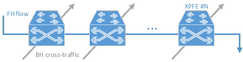
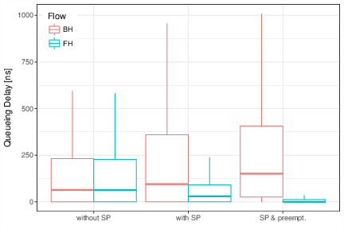
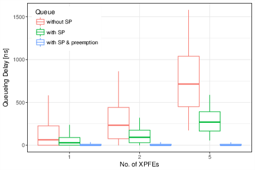
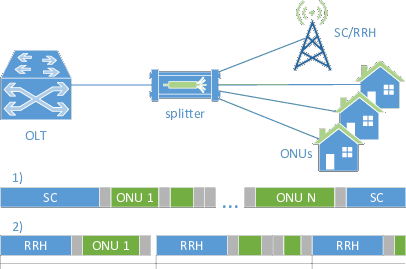
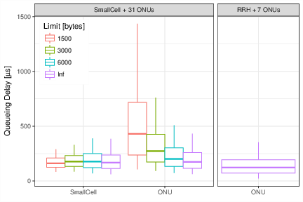
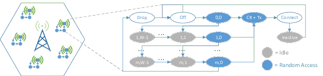
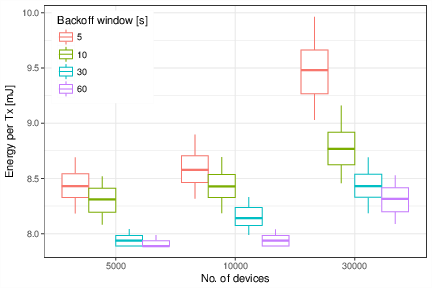

```{r setup, cache=FALSE, include=FALSE}
knitr::opts_chunk$set(collapse=TRUE, echo=TRUE, eval=FALSE)
knitr::read_chunk("includes/5G-1.R")
knitr::read_chunk("includes/5G-2.R")
knitr::read_chunk("includes/5G-3.R")
```

## Crosshauling of FH and BH traffic

<div style="text-align:center">

</div>

### Configuration

```{r 1.configuration}
```

### Simulation

```{r 1.simulation}
```

### Analysis

```{r 1.analysis}
```

<div style="text-align:center">
{width=47%} {width=47%}
</div>

## Mobile traffic backhauling with FTTx

<div style="text-align:center">

</div>

### Configuration

```{r 2.configuration}
```

### Simulation

```{r 2.helpers}
```

```{r 2.simulation}
```

### Analysis

```{r 2.analysis}
```

<div style="text-align:center">

</div>

## Energy efficiency for massive IoT

<div style="text-align:center">

</div>

### Configuration

```{r 3.configuration}
```

### Simulation

```{r 3.simulation}
```

### Analysis

```{r 3.analysis}
```

<div style="text-align:center">

</div>
